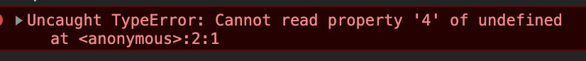
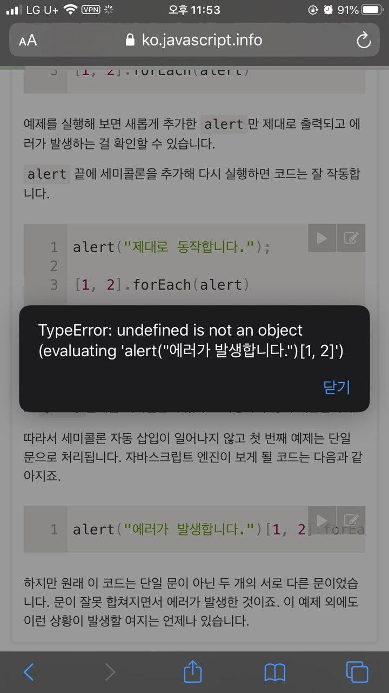

# 자바스크립트 기초
* 작성일 : 2020-5-18
* 작성자 : alpaca
* 공부 단원 : 2-2, 코드 구조!
* 공부한 페이지 주소 : [링크](https://ko.javascript.info/structure)

## 배운 내용 정리
* **문(Statement)** 은 문법 구조(Syntax Structure)와 명령어(Command)를 의미한다.
  * 뭔소리냐?
  * Hello, World! 메세지를 보여주는 alert('Hello, World!')문장을 보면
  ```js
    alert('Hello'); // <- 이것이 한 문
    alert('World!'); // <- 이것도 한 문
  ```
  이라 한다.
  * 문을 구분하기 위해 세미콜론(SemiColon)을 사용한다.
* **세미콜론**
  * javascript(이하 js)는 세미콜론 자동삽입을 지원한다.
    * 엔진에 구현되어 있음
    * 하지만 모든 상황에 자동삽입이 지원되는게 아니므로 주의해야 된다.
      * 그냥 세미콜론 쓰라는 얘기다
    * 예시
      ```javascript
        /* 1번 */
        alert(1 +
        3
        +2);
        /* 실행 결과는 어떨까? */
        /* 2번 */
        alert(1+3)
        [1, 3].forEach(alert)
      ```
      * 1번 예제
        * 잘 실행됨
      * 2번 예제
        * 에러뜸
        
        * 작성자는 alert메세지로 4, 1, 3 숫자가 뜨는 것을 기대했으나 4만 뜨고 에러가 발생한다. 이유는 js engine이 위 2번 코드를 아래와 같이 해석하기 때문이다.
        ```js
          alert(1+3)[1,3].forEach(alert);
          //
        ```
          * 브라우저마다 다르네..? chrome mobile에서의 에러 내용과 다르게 나타난다!!
          
          * 이걸로 보아 엔진에 따라 다르게 해석되는 js를 알 수 있다.(기반은 같지만 에러함수가 다른듯)
* 주석
  * comment, 코드 설명 등의 내용을 작성하기 위해 사용
  * js엔진은 주석을 무시하고 코드를 실행한다.
  * 사용방법은 2가지가 있다.
    1. 한줄 주석 : 두 개의 슬래시를 이용한다.
    2. 여러줄 주석 : 슬래시 별표, 별표 슬래시(/* */)
    ```js
      // 1번 주석

      /* *****************
       * 2번
       * 주석 연습
       ***************** */
    ```

  * 중첩 주석은 지원되지 않는다.
    ```js
      /*
        /* 중첩이 된다? */    <- 여기서 주석 끝남
      */      <- 에러 뜸
    ```
  * 주석의 경우, production 환경에서 배포전에 코드를 압축해주는 도구들이 있으므로 사용하는게 좋다.
    * 왜냐면 엔진이 주석을 무시하긴 하지만 주석의 내용을 무시하는데 드는 비용이 생기기 때문이다. 이를 위해 production 환경에서는 주석을 제외하고 배포할 수 있도록 하는데, 되도록이면 꼭 이용하는 것이 좋겠다.(큰 규모로 갈수록 유용해짐)
